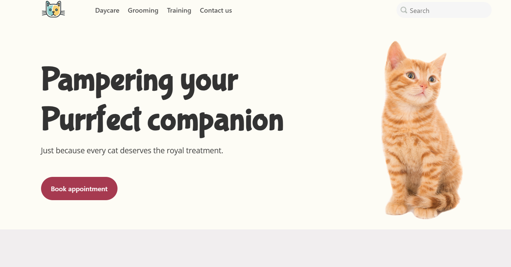

## Whiskers

This is the website for Whiskers Cat Care, a daycare, boarding and grooming 
facility for all kinds of felines! This was the final project for Tools and 
Automation in Software Development. 

### Authors

-Sarah Mitchell - team leader, editor, worked on header, footer, contact-us section

-Ashedzi Solomon - hero-banner, about-section, details page, responsiveness

-Xiyu Zhou - services

### Examples
Some examples we used were [Belly Rub Club](https://www.thebellyrubclub.ca/), and [Cats Cradle](http://www.petsperfectpaws.com/Cats-Cradle.html)

### Project Features
- Responsive Design: The layout is optimized for different screen sizes (desktop, tablet, mobile) to ensure accessibility and usability across devices.    

- GitHub Pages Hosting: The site is hosted on GitHub Pages, indicating it is a static site without server-side processing.  

-Basic Form Validation (via JavaScript): The inclusion of app.js and formValidation.js (as indicated in your HTML and the content of those files) suggests basic client-side form validation is implemented for the contact form, improving user experience by providing immediate feedback on input.

-Daycare Detail Page: A separate page (daycare-detail.html with its own CSS daycare-detail.css) provides more specific information about the daycare service, including pricing and the temperament check process.

-Image Gallery (Former Clients): A section showcasing "Purrfectly Pleased Clients" with a gallery of cat images demonstrates positive customer experiences and builds trust.

### Technologies I Used
- HTML5
- CSS3
- JS
- Markdown
- Github Pages
- Google Fonts
- ES Modules 

### Check it out [here](https://sarsbars.github.io/whikers-cat-care)